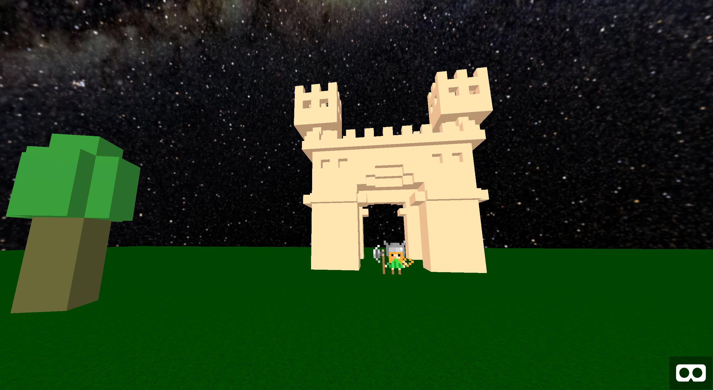

# A-Frame Experiments

See the experiments on our [GitHub Page](https://devpaul.github.io/aframe-experiments).

## Overview

This repository contains a number of brief AFrame experiments. Each is designed to test or exemplify one aspect of 
working with VR or 3d.

*All* of these experiments use AFrame typings under `/experiments/@types/aframe`. They serve as a test platform for
the [Definitely Typed AFrame ambient declarations](https://github.com/DefinitelyTyped/DefinitelyTyped/tree/master/types/aframe).
These definitions may be ahead of the Definitely Typed repo as they're updated in line w/ the experiments.

## Quick Start

Each experiment is made to be self-contained. TypeScript 3+ is used for all of the experiments. In some cases
experiments may use [project references](https://blogs.msdn.microsoft.com/typescript/2018/07/30/announcing-typescript-3-0/#project-references).

The root `package.json` has scripts that support building everything. To generate a build of everything in `dist`:

* `npm install`
* `npm run installall`
* `npm run buildall`
* `npm run dist`

